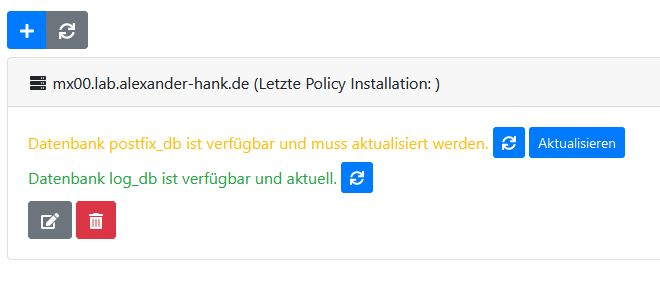

## Introduction

Since Betterprotect is only a management frontend, it requires Postfix to receive and send email.

Betterprotect comes with a policy service, which hooks into Postfix.

This guide assumes you want to install Postfix on a clean Debian Buster server.

## Install packages
````bash
apt install postfix postfix-mysql mariadb-server sudo rsyslog-mysql php7.3-cli php7.3-pdo php7.3-json php7.3-mysql php7.3-mbstring
````

!!! info
    PHP is required to execute the Betterprotect Policy Service.

## Logging
Betterprotect utilizes Rsyslog to process the Postfix log data. We configure Rsyslog to forward the log data into a MySQL/MariaDB database which is called "Syslog" by default.
The database is automatically created by the ``rsyslog-mysql`` package. On user request Betterprotect retrieves the log data from this database and displays a parsed result.

The configuration file ``/etc/rsyslog.d/mysql.conf`` is also automatically created by the ``rsyslog-mysql`` package.

## Database
Secure your database server:

````bash
mysql_secure_installation
````

Create a database:

````bash
mysql -u root -p
````

````mysql
CREATE DATABASE postfix;
CREATE USER postfix@localhost IDENTIFIED BY 'your-secret-password-here';
# Database for the policy service
GRANT ALL ON postfix.* TO postfix@localhost;

# Database for logs
GRANT ALL ON Syslog.* TO postfix@localhost;
FLUSH PRIVILEGES;
````

!!! note 
    We will need the password later.
    This database must be accessible from the Betterprotect server.
    The recommended way of achieving this is using SSH tunnels.
    The exact configuration is not in the scope of this guide.
    If you are unsure about how to achieve the connectivity open an issue.

## Add user
Betterprotect requires a user for the following tasks:

 - Displaying the mail queue using ``postqueue``
 - Deleting mails from the mail queue using ``postsuper``
 - Executing the Betterprotect Policy Service

````bash
adduser --shell /bin/bash --disabled-password betterprotect
````

Allow the user to execute ``postqueue`` and ``postsuper`` using sudo by creating the file ``/etc/sudoers.d/betterprotect`` with the following content:
````
betterprotect ALL=(ALL) NOPASSWD: /usr/sbin/postqueue,/usr/sbin/postsuper
````

## Setup the Policy Service
````bash
mkdir /opt/betterprotect-policy-service
cd /opt/betterprotect-policy-service
wget https://github.com/Hank-IT/Betterprotect/releases/download/v1.4/betterprotect-policy-service-production-8-e441796c7ec3b5bab6d200a28d4318cd62e2f52e.tar.gz
tar -xvf betterprotect-policy-service-production-8-e441796c7ec3b5bab6d200a28d4318cd62e2f52e.tar.gz
rm betterprotect-policy-service-production-8-e441796c7ec3b5bab6d200a28d4318cd62e2f52e.tar.gz
chown -R betterprotect:betterprotect /opt/betterprotect-policy-service
````

!!! warning "Releases"
    Always check the release tab on the Github repository for the current version, as the link here might be outdated.
    If the current version does not include a policy service release, you can use the version from the previous release.
    
## Configure Postfix
This describes the basic postfix setup needed for Betterprotect.
This is not a complete configuration, but rather a starting point.
Configure your postfix server to your needs and then insert the marked lines.
If you are unsure, you can open an issue: https://github.com/Hank-IT/Betterprotect/issues

### main.cf
The file ``/etc/postfix/main.cf`` holds the main configuration.

````
inet_interfaces = all
compatibility_level=2
mydestination = $myhostname localhost.$mydomain localhost
myhostname = mx00.contoso.com
myorigin = $mydomain

smtpd_helo_required = yes
strict_rfc821_envelopes = yes
disable_vrfy_command = yes

unknown_address_reject_code = 554
unknown_hostname_reject_code = 554
unknown_client_reject_code = 554

# Mail message size 50mb
message_size_limit=52428800

#### TLS Settings ####
tls_preempt_cipherlist = yes
tls_ssl_options = NO_COMPRESSION
tls_high_cipherlist=EDH+CAMELLIA:EDH+aRSA:EECDH+aRSA+AESGCM:EECDH+aRSA+SHA384:EECDH+aRSA+SHA256:EECDH:+CAMELLIA256:+AES256:+CAMELLIA128:+AES128:+SSLv3:!EXPORT:!aNULL:!eNULL:!LOW:!3DES:!MD5:!EXP:!PSK:!DSS:!RC4:!SEED:!ECDSA:CAMELLIA256-SHA:AES256-SHA:CAMELLIA128-SHA:AES128-SHA
tls_random_source = dev:/dev/urandom
tls_random_bytes = 128
tls_daemon_random_bytes = 64

#### Outgoing Connections ####
smtp_use_tls = yes
smtp_tls_security_level=may
smtp_tls_CAfile=/etc/letsencrypt/live/mx00.contoso.com/fullchain.pem
smtp_tls_cert_file=/etc/letsencrypt/live/mx00.contoso.com/cert.pem
smtp_tls_key_file=/etc/letsencrypt/live/mx00.contoso.com/privkey.pem
smtp_tls_session_cache_database = btree:${data_directory}/smtp_scache
smtp_tls_loglevel = 1
smtp_tls_ciphers = high

#### Incoming Connections ####
smtpd_use_tls = yes
smtpd_tls_security_level = may
smtpd_tls_CAfile = /etc/letsencrypt/live/mx00.contoso.com/fullchain.pem
smtpd_tls_cert_file = /etc/letsencrypt/live/mx00.contoso.com/cert.pem
smtpd_tls_key_file = /etc/letsencrypt/live/mx00.contoso.com/privkey.pem
smtpd_tls_session_cache_database = btree:${data_directory}/smtpd_scache
smtpd_tls_mandatory_protocols = !SSLv2,!SSLv3
smtpd_tls_protocols = !SSLv2,!SSLv3
smtpd_tls_received_header = yes
smtpd_tls_ask_ccert = yes
smtpd_tls_loglevel = 1
smtpd_tls_ciphers = high
smtpd_tls_dh1024_param_file = /etc/ssl/postfix/dhparams.pem

# Used for Betterprotect's Relay Domains feature
relay_domains = mysql:/etc/postfix/mysql-relay-domains.cf

# Used for Betterprotect's Recipient feature
relay_recipient_maps = mysql:/etc/postfix/mysql-relay-recipients.cf

# Common parameters
soft_bounce = no
local_recipient_maps =
local_transport = error:no local delivery
smtpd_banner = mx00.contoso.com ESMTP
alias_maps = hash:/etc/aliases
alias_database = hash:/etc/aliases
delay_warning_time = 4h

# Used for Betterprotect's Milter feature
smtpd_milter_maps = mysql:/etc/postfix/mysql-milter-map.cf

# Used for Betterprotect's Transport map feature
transport_maps = mysql:/etc/postfix/mysql-transport-maps.cf

mynetworks = 127.0.0.0/8 [::ffff:127.0.0.0]/104 [::1]/128

smtpd_recipient_restrictions =  permit_mynetworks,
                                # Prevent open relay
                                reject_unauth_destination,
                                # Used for Betterprotect's Whitelist/Blacklist feature
                                check_policy_service unix:private/betterprotect-policy-server,
                                reject_unknown_helo_hostname,
                                reject_non_fqdn_helo_hostname,
                                reject_invalid_helo_hostname,
                                reject_unknown_client_hostname,
                                reject_non_fqdn_sender,
                                reject_unknown_sender_domain,
                                reject_unknown_recipient_domain,
                                reject_non_fqdn_recipient,
                                reject_rbl_client zen.spamhaus.org,

smtpd_relay_restrictions =      permit_mynetworks,
                                # Prevent open relay
                                reject_unauth_destination,

# Prevent bulk mail software
smtpd_data_restrictions =       reject_multi_recipient_bounce,
                                reject_unauth_pipelining,
````

!!! warning
    The options ``smtpd_milter_maps``, ``relay_domains``, ``relay_recipient_maps``, ``transport_maps`` need to be set like this, so postfix queries the database for these values.
    The ``check_policy_service`` under ``smtpd_recipient_restrictions`` is required for the Betterprotect Policy Service we installed earlier.
    
### master.cf
We need to instruct Postfix to invoke the Betterprotect Policy Service. We achieve that by created a new entry in Postfixs ``/etc/postfix/master.cf`` config.

````
betterprotect-policy-server unix -        n       n       -       0       spawn
      user=betterprotect argv=/usr/bin/php -q /opt/betterprotect-policy-service/app/app.php
````

### relay_domains
The option ``relay_domains`` needs to be set to ``mysql:/etc/postfix/mysql-relay-domains.cf``, which will instruct Postfix to read the relay domains from the database.

````
user = postfix
password = securePassword
hosts = 127.0.0.1
dbname = postfix
query = SELECT domain from relay_domains WHERE domain = '%s' limit 1
````

### relay_recipient_maps 
The option ``relay_recipient_maps`` needs to be set to ``mysql:/etc/postfix/mysql-relay-recipients.cf``, which will instruct Postfix to read the recipient maps from the database.

````
user = postfix
password = securePassword
hosts = 127.0.0.1
dbname = postfix
query = select action from relay_recipients where payload = '%s' limit 1
````

### transport_maps
The option ``transport_maps``  needs to be set to ``mysql:/etc/postfix/mysql-transport-maps.cf``, which will instruct Postfix to read the transport maps from the database.

````
user = postfix
password = securePassword
hosts = 127.0.0.1
dbname = postfix
query = SELECT payload from transport_maps where domain = '%s' limit 1;
````

### smtpd_milter_maps
The option ``smtpd_milter_maps``  needs to be set to ``mysql:/etc/postfix/mysql-milter-map.cf``, which will instruct Postfix to read the milter maps from the database.

````
user = postfix
password = securePassword
hosts = 127.0.0.1
dbname = postfix
query = SELECT definition from milter_exceptions WHERE payload = '%s' ORDER BY priority LIMIT 1
````

With milter maps you can utilize different milters depending on the client's ip address.

## Add Postfix to Betterprotect

Sign into Betterprotect and navigate to the menu "Server". Click the + to add a new server:

### Server


Insert the dns hostname or ip address of your server. Optional enter a description and click next.

### Postfix


Insert the database credentials for the Postfix database you created earlier.
The setup will test the database connectivity for you.

### Console


Betterprotect requires SSH access to the server to execute ``postsuper`` and ``postqueue``. This access is realized using public key authentication.

| Field       | Description |
| ----------- | ----------- |
| User        | The username of the user we created earlier. |
| Public key  | The public key of the server we want to add. The key will be verified. If the verification fails, the actual public key of the server is logged to storage/logs. | 
| Private key | The private key used for authentication. Create a SSH key pair for this user and add the public key to the users ``~/.ssh/authorized_keys`` file. After that paste the private key here.
| sudo        | The full path to the sudo binary 
| postqueue   | The full path to the postqueue binary 
| postsuper   | The full path to the postsuper binary 

### Logging


The Betterprotect log viewer requires the database credentials of the ``syslog`` database, which was automatically created earlier, while we installed the ``rsyslog-mysql`` package. 
For ease of configuration we also granted the ``postfix`` user access to this database. 
So you can insert the database credentials as we did earlier.

!!! info
    You are free to create a second user and grant him permission for the database.
    
### Finish
You can skip the last step by unchecking the "Enable Amavis" checkbox, since this feature is currently not implemented.

After clicking finish you can see your newly created server:

### Update database


Click on "Update" next to the yellow marked "postfix_db" to create the necessary database tables.
You might also have to perform this, after updating Betterprotect.

### Install policy
To push the current data in Betterprotect to the server, you can click on the green "Install policy" button and select your server. 